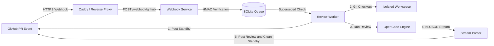

<div align="center">

# OpenCode AI PR Reviewer

### Automated, AI Code Reviewer for GitHub Pull Requests

[](https://nodejs.org/)
[](https://www.npmjs.com/package/opencode-pr-review)
[](https://github.com/ardiannurcahya/opencode-pr-review/pkgs/container/opencode-pr-review)
[](https://www.typescriptlang.org/)
[](https://docs.github.com/en/apps)
[](https://opencode.ai)
[](https://sqlite.org/)

<p align="center">
  <b>Instant Standby Feedback</b> | 
  <b>GitHub Native Alert Badges</b> | 
  <b>Smart Commit Deduplication</b> | 
  <b>Zero Noise on Clean PRs</b>
</p>

---

</div>

## Overview

**OpenCode PR Reviewer** is a self-hosted automated Pull Request review service. It integrates with GitHub using a **GitHub App**, listens for Pull Request events in real-time, performs static and semantic analysis with the **OpenCode AI engine**, and publishes inline comments utilizing native **GitHub Alert syntax**.

```text
Developer Opens PR -> Webhook (<1s) -> Standby Comment ("Analyzing...") -> OpenCode Review -> Clean Review / Alert Callouts
```

---

## Documentation Index

| Document | Description |
| :--- | :--- |
| **[GitHub App Creation and Setup](docs/github-app-setup.md)** | Step-by-step guide for creating a GitHub App, configuring permissions, generating private keys, and repository installation. |
| **[Custom Domain and Reverse Proxy](docs/domain-and-reverse-proxy.md)** | Network configuration guide covering DNS A-records, Caddy (automated TLS), Nginx with Certbot, and Cloudflare Tunnels. |
| **[Running and Deployment Guide](docs/running-and-deployment.md)** | Production operations guide covering systemd services, Docker Compose, logging, and model configuration. |
| **[Architecture and Workflow Specification](docs/architecture-and-workflow.md)** | Technical specification including Mermaid sequence diagrams, queue deduplication, NDJSON stream parsing, and subsystem details. |

---

## Core Features

- **Instant Standby Feedback**: Posts an immediate acknowledgment comment upon receiving a PR event, and automatically deletes it when the official review is published.
- **GitHub Native Alert Formatting**: Formats review findings using standard GitHub markdown callouts (`[!CAUTION]`, `[!WARNING]`, `[!NOTE]`) for diff clarity.
- **Zero Review Noise on Clean PRs**: Approved PRs receive a clean summary without generating inline conversation threads, preventing repetitive conversation resolution steps.
- **Smart Commit Deduplication**: If multiple commits are pushed in rapid succession, superseded jobs in the queue are automatically bypassed to conserve compute resources.
- **Asymmetric Authentication**: Authenticates via RS256 JWT using GitHub App private keys, generating short-lived installation access tokens.
- **Universal and Repository-Specific Prompts**: Provides standard baseline review rules in [`prompts/review.md`](prompts/review.md) with per-repository customization support in `config.yaml`.
- **Multi-Provider LLM Integration**: Routes repositories to different models (e.g., DeepSeek, GPT-4o, Claude) through local OpenCode configuration (`~/.config/opencode/opencode.json`).

---

## Architecture Overview



---

## Installation & Quick Start

OpenCode PR Reviewer can be installed and deployed in three ways:

### Option 1: Via NPM Package (Recommended)

Install the global CLI binary or run directly using `npx`:

```bash
# Global installation
npm install -g opencode-pr-review

# Or run directly via npx
npx opencode-pr-review
```

#### Setup Configuration:
```bash
# Create working directory
mkdir -p ~/opencode-pr-review && cd ~/opencode-pr-review

# Create .env and config.yaml
cat << 'EOF' > .env
PORT=8088
WEBHOOK_SECRET=your_webhook_secret_from_github_app
GITHUB_APP_ID=123456
GITHUB_PRIVATE_KEY_PATH=./github-app.private-key.pem
EOF

cat << 'EOF' > config.yaml
server:
  port: 8088
  webhook_secret: "${WEBHOOK_SECRET}"

github:
  app_id: 123456
  private_key_path: "./github-app.private-key.pem"

opencode:
  default_model: "custom_ai/deepseek-ai/deepseek-coder"
  timeout_seconds: 300

repositories:
  your-org/your-repo:
    enabled: true
    base_branch: "main"
EOF

# Place your GitHub App private key
# cp /path/to/github-app.private-key.pem ./github-app.private-key.pem

# Start reviewer service
opencode-pr-review
```

---

### Option 2: Via Prebuilt Docker Image (GHCR)

Run container directly from the GitHub Container Registry without cloning the repository or building locally:

```bash
docker run -d \
  --name opencode-pr-reviewer \
  --restart unless-stopped \
  -p 8088:8088 \
  --env-file .env \
  -v $(pwd)/config.yaml:/app/config.yaml:ro \
  -v $(pwd)/github-app.private-key.pem:/app/github-app.private-key.pem:ro \
  -v $(pwd)/data:/app/data \
  -v $(pwd)/workspaces:/app/workspaces \
  -v ~/.config/opencode:/root/.config/opencode:ro \
  ghcr.io/ardiannurcahya/opencode-pr-review:latest
```

Or using **Docker Compose**:

```yaml
version: '3.8'

services:
  opencode-pr-reviewer:
    image: ghcr.io/ardiannurcahya/opencode-pr-review:latest
    container_name: opencode-pr-reviewer
    restart: unless-stopped
    ports:
      - "8088:8088"
    env_file:
      - .env
    volumes:
      - ./config.yaml:/app/config.yaml:ro
      - ./github-app.private-key.pem:/app/github-app.private-key.pem:ro
      - ./data:/app/data
      - ./workspaces:/app/workspaces
      - ~/.config/opencode:/root/.config/opencode:ro
```

```bash
docker compose up -d
```

---

### Option 3: From Source Code

Clone the repository and run locally for development:

```bash
# 1. Clone repository and install dependencies
git clone https://github.com/ardiannurcahya/opencode-pr-review.git
cd opencode-pr-review
npm install

# 2. Configure environment and credentials
cp .env.example .env
cp config.example.yaml config.yaml

# 3. Build and start
npm run build
npm start
```

---

## Review Output Format

### 1. Approved Pull Request (`APPROVE`)
```markdown
## AI Code Review Summary

**Verdict**: `APPROVE`

### Summary
- Feature implementation is robust and follows repository standards.
- No security vulnerabilities, resource leaks, or breaking changes identified.
- Safe to merge.

**Status**: Clean! Code is approved and ready to merge.
```

### 2. Critical Security Finding (`REQUEST_CHANGES`)
```markdown
## AI Code Review Summary

**Verdict**: `REQUEST_CHANGES`

### Summary
- Hardcoded production secret identified in source code.
- Raw SQL string concatenation creates critical SQL Injection risk. Do not merge.

**Blocking Issues**: 2 critical issue(s) identified. Must be resolved before merge.
```

**Inline Comment Example**:
```markdown
> [!CAUTION]
> **CRITICAL**: SQL injection vulnerability: raw string concatenation of `username` allows authentication bypass. Replace with parameterized query `db.QueryRow("SELECT ... WHERE user = ?", username)`.
```

---

## Project Structure

```text
opencode-pr-review/
├── docs/                                # Detailed technical guides
│   ├── github-app-setup.md              # GitHub App creation and installation
│   ├── domain-and-reverse-proxy.md      # DNS, Caddy, Nginx, and TLS setup
│   ├── running-and-deployment.md        # systemd, Docker, and logging
│   └── architecture-and-workflow.md     # Architecture and sequence specifications
├── prompts/                             # Review prompt templates
│   ├── review.md                        # Master pragmatic review prompt
│   └── examples/                        # Specialized prompts (backend, frontend, OSS)
├── src/                                 # TypeScript source code
│   ├── index.ts                         # Webhook server and health endpoints
│   ├── config.ts                        # YAML and environment configuration loader
│   ├── github/                          # GitHub App JWT and REST API client
│   ├── queue/                           # SQLite queue and deduplication engine
│   ├── reviewer/                        # OpenCode runner and NDJSON stream parser
│   ├── worker/                          # Background review worker loop
│   └── workspace/                       # Git repository and workspace manager
├── config.example.yaml                  # Configuration template
├── docker-compose.yml                   # Docker Compose definition
├── Dockerfile                           # Container image definition
├── package.json                         # Project dependencies and build scripts
└── test-audit.mjs                       # Automated test suite
```

---

## Testing

Run the automated test suite to verify queue deduplication, HMAC verification, NDJSON stream parsing, and prompt templates:

```bash
npm test
```

---

## License

This project is licensed under the [MIT License](LICENSE).
