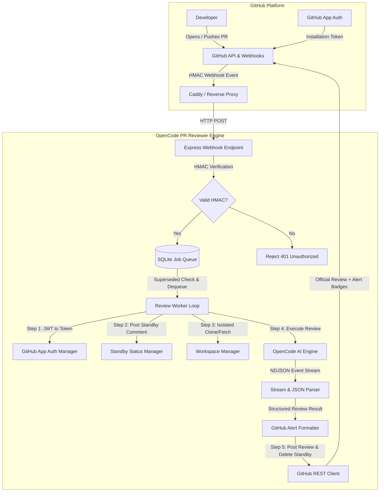
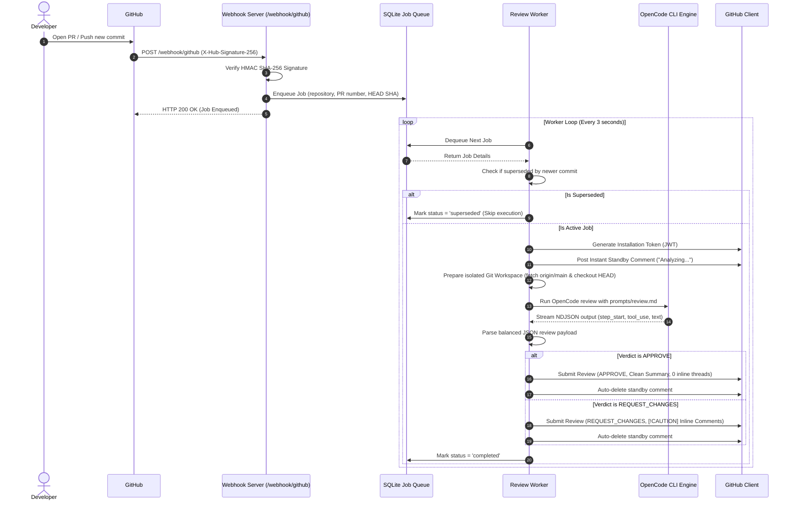

# Architecture and Workflow Specification

This document details the internal architecture, event lifecycle, and subsystems of the **OpenCode PR Reviewer**.

---

## 1. High-Level System Architecture



---

## 2. End-to-End Review Sequence Diagram



---

## 3. Core Subsystems

### 3.1. Webhook Signature Verification (`src/github/webhook.ts`)
Incoming payloads from GitHub are verified using HMAC SHA-256 against `WEBHOOK_SECRET`:
- Raw request body buffers are captured before JSON parsing.
- Constant-time buffer comparison (`crypto.timingSafeEqual`) prevents timing attack vulnerabilities.
- Non-actionable PR events (such as `labeled`, `assigned`, `closed`) are filtered out immediately.

### 3.2. SQLite Queue and Smart Deduplication (`src/queue/queue.ts`)
- **Zero Heavy Dependencies**: Implemented using Node.js experimental SQLite module or SQLite3.
- **Smart Deduplication**: When multiple commits are pushed rapidly to the same PR, older queued jobs are marked as superseded and bypassed, conserving LLM token capacity.

### 3.3. GitHub App Token Management (`src/github/auth.ts`)
- The service generates an RS256 JWT signed with the GitHub App private key (`github-app.private-key.pem`).
- The JWT is exchanged with GitHub for a short-lived **Installation Access Token** (valid for 1 hour).
- Eliminates the need for long-lived Personal Access Tokens (PAT).

### 3.4. Git Workspace Isolation (`src/workspace/git.ts`)
- Repositories are cloned into dedicated directories (`workspaces/<owner>/<repo>/pr-<number>`).
- Re-fetches the latest target base branch (`origin/main`) and resets the working tree cleanly prior to analysis.

### 3.5. OpenCode NDJSON Stream Parser (`src/reviewer/parser.ts`)
OpenCode outputs a structured event stream (`step_start`, `tool_use`, `step_finish`, `text`). The parser:
1. Isolates the **trailing contiguous block of `text` events** (the final model output, excluding intermediate agent thoughts).
2. Applies a **balanced brace parser** (`findBalancedJsonObject`) to extract the JSON payload without truncation from nested markdown code blocks.
3. Normalizes verdicts (`PASS` to `APPROVE`, `FAIL` to `REQUEST_CHANGES`).

### 3.6. Standby Comment Lifecycle (`src/worker/worker.ts` & `src/github/client.ts`)
1. **Immediate Acknowledgment**:
   ```markdown
   > **AI Code Reviewer** is currently analyzing your code changes...
   > *Estimated completion time: ~30-60 seconds.*
   ```
2. **Automated Cleanup**:
   Upon publishing the official review, the standby comment is deleted to keep the PR timeline clean.
3. **Orphan Cleanup**:
   Stale standby comments from interrupted previous runs are swept and removed on each execution cycle.

### 3.7. GitHub Native Alert Formatting (`src/github/client.ts`)
Review comments utilize GitHub markdown callout formatting:
- `[!CAUTION]` for **CRITICAL** security vulnerabilities and fatal bugs.
- `[!WARNING]` for **WARNING** logic issues.
- `[!NOTE]` for **INFO** suggestions.
