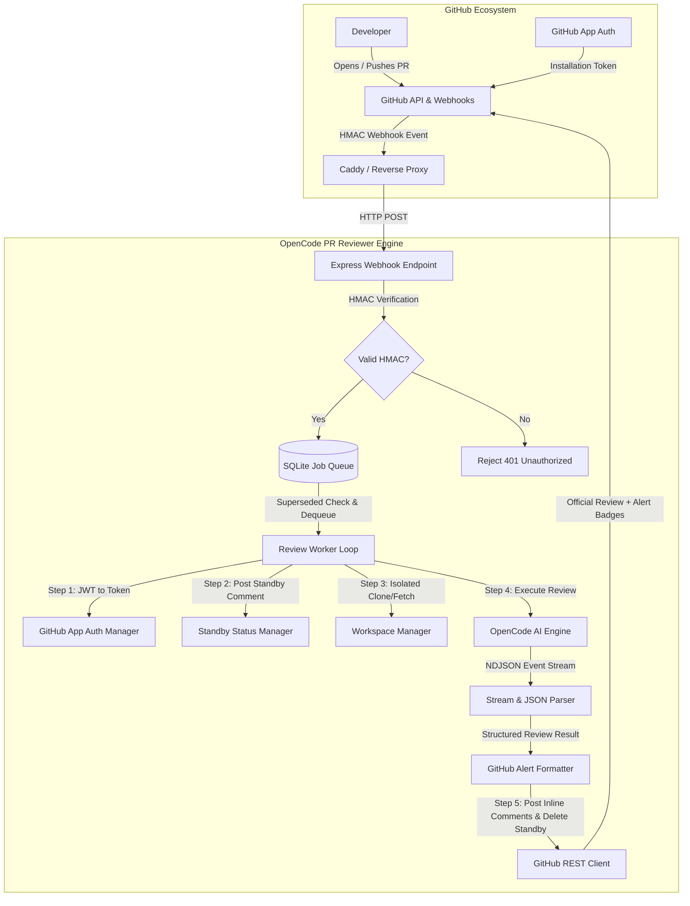
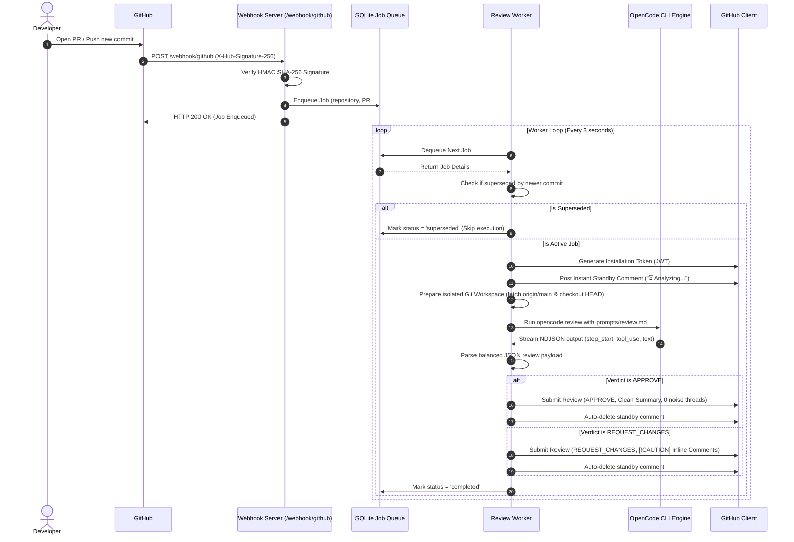

# 🏛️ Architecture & Workflow Deep Dive

This document details the internal architecture, event lifecycle, and subsystems of the **OpenCode PR Reviewer**.

---

## 1. High-Level System Architecture



---

## 2. End-to-End Review Sequence Diagram



---

## 3. Core Subsystems

### 3.1. Webhook Signature Verification (`src/github/webhook.ts`)
Every incoming payload from GitHub is verified using HMAC SHA-256 against `WEBHOOK_SECRET`:
- Raw request body buffers are captured before JSON serialization.
- Timing-safe buffer comparison (`crypto.timingSafeEqual`) prevents timing attack vulnerabilities.
- Non-relevant PR actions (e.g. `labeled`, `assigned`, `closed`) are filtered out immediately.

### 3.2. SQLite Queue & Smart Deduplication (`src/queue/queue.ts`)
- **Zero Heavy Dependencies**: Powered by Node.js native experimental SQLite or SQLite3.
- **Smart Deduplication**: If a developer pushes 3 commits rapidly (`commit A` -> `commit B` -> `commit C`), the worker automatically identifies that `commit A` and `commit B` are superseded by `commit C`, marking them skipped and saving valuable LLM compute.

### 3.3. GitHub App Token Management (`src/github/auth.ts`)
- The service signs an RS256 JWT using the GitHub App's private key (`github-app.private-key.pem`).
- The JWT is exchanged for a short-lived **Installation Access Token** (valid for 1 hour).
- No long-lived Personal Access Tokens (PAT) are stored in the codebase.

### 3.4. Git Workspace Isolation (`src/workspace/git.ts`)
- Repositories are cloned into isolated directories (`workspaces/<owner>/<repo>/pr-<number>`).
- Re-fetches the latest target base branch (`origin/main`) and resets the working tree cleanly before running AI tools.

### 3.5. OpenCode NDJSON Stream Parser (`src/reviewer/parser.ts`)
OpenCode outputs a structured event stream (`step_start`, `tool_use`, `step_finish`, `text`). The parser:
1. Isolates the **trailing contiguous block of `text` events** (the final model answer, filtering out internal agent narration).
2. Uses a **balanced curly-brace parser** (`findBalancedJsonObject`) to extract the review payload without breaking on nested markdown code blocks.
3. Normalizes verdicts (`PASS` / `APPROVE`, `FAIL` / `REQUEST_CHANGES`).

### 3.6. Standby Comment Lifecycle (`src/worker/worker.ts` & `src/github/client.ts`)
1. **Instant Feedback (< 2 seconds)**:
   ```markdown
   > ⏳ **AI Code Reviewer** is currently analyzing your code changes...
   > *Estimated completion time: ~30–60 seconds.*
   ```
2. **Clean Auto-Deletion**:
   When the review completes, the temporary standby comment is cleanly deleted, leaving a pristine PR conversation history.
3. **Orphan Sweeper**:
   On every new run, stale standby comments from previously interrupted/crashed runs are automatically cleaned up.

### 3.7. GitHub Native Alert Formatting (`src/github/client.ts`)
Review comments leverage GitHub native Markdown alert syntax:
- 🔴 `[!CAUTION]` for **CRITICAL** security flaws and severe bugs.
- 🟡 `[!WARNING]` for **WARNING** logic bugs.
- 🔵 `[!NOTE]` for **INFO** suggestions.
